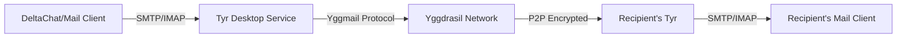

<div align="center">

# Tyr Desktop

### True Peer-to-Peer Email on Yggdrasil Network

[](LICENSE)
[](https://golang.org)
[](https://reactjs.org)
[](https://www.typescriptlang.org)
[](https://wails.io)


**[English](#) | [Русский](README.ru.md)**

</div>

---

## 🌐 What is Tyr Desktop?

We're taught that email must go through servers. Why? Because the Internet was built around centralized infrastructure. Every email you send travels through multiple servers - your provider's server, maybe a few relay servers, and finally your recipient's provider's server. Each hop is a potential point of surveillance, censorship, or failure.

Even "encrypted" email solutions still rely on these centralized servers. They encrypt the message content but the metadata - who you're talking to, when, how often - is visible to anyone watching the servers.

But there is a network, called **[Yggdrasil](https://yggdrasil-network.github.io/)**, that gives everyone a free IPv6 and doesn't need a blessing from your ISP. We finally have this possibility to use true P2P email. And moreover, this network has strong encryption to protect all data that flows from one IP to another.

**Tyr Desktop brings true peer-to-peer email to your computer** using these unusual conditions. Unlike traditional email clients, Tyr doesn't need:

- ❌ Centralized mail servers (the connections are straight P2P)
- ❌ Message encryption layers (the network takes care of that)
- ❌ Port forwarding or STUN/TURN servers (Yggdrasil handles NAT traversal)

---

## ✨ Features

| Feature | Description |
|---------|-------------|
| 🔗 **DeltaChat Integration** | One-click automatic setup with the best decentralized messenger |
| 📧 **Local SMTP/IMAP Server** | Complete mail server running directly on your desktop (ports 1025/1143) |
| 🔐 **Cryptographic Identity** | Automatic Ed25519 key generation - your mail identity cannot be spoofed |
| 🌍 **Yggdrasil Network** | Connect via configurable peers - censorship-resistant by design |
| 🚀 **Auto-Start on Boot** | Optional system startup integration for always-on availability |
| 💾 **Encrypted Backup & Restore** | Password-protected AES-256-GCM backups with optional key export |
| 🔒 **OS Keyring Integration** | Secure password storage via Windows Credential Manager / GNOME Keyring |
| 💻 **Modern Web UI** | React-based interface with Y2K Dark Theme and glassmorphic effects |
| 🌓 **System-Aware Themes** | Automatic light/dark theme switching based on OS preferences |
| ⚡ **Hot Reload** | Real-time peer management without service restart |
| 📊 **Real-Time Monitoring** | Live service status, peer connections, and log viewer |

---

## 🛠️ How It Works



Tyr Desktop runs a complete email server right on your computer, using the Yggdrasil network for transport. The **[Yggmail](https://github.com/JB-SelfCompany/yggmail)** mail server (built in Go) is embedded directly into the application.

It provides standard **SMTP** and **IMAP** protocols on localhost (`127.0.0.1:1025` and `127.0.0.1:1143`). Any email client can connect to these ports - but we recommend **DeltaChat** for the best P2P messaging experience.

### 📬 Mail Address Format

Every Tyr installation generates unique **Ed25519 cryptographic keys**. Your mail address is derived from your public key:

```
<64-hex-characters>@yggmail
```

This means your identity is **cryptographically verifiable** and cannot be spoofed.

---

## System Requirements

### Windows
- Windows 10 or later (64-bit or 32-bit)
- 150 MB free disk space
- No administrator rights required
- WebView2 runtime (usually pre-installed on Windows 11, auto-downloaded on Windows 10)

### Linux
- Ubuntu 22.04+, Debian 12+, or compatible distribution
- X11 or Wayland desktop environment
- 150 MB free disk space
- WebKitGTK (usually pre-installed)

## Installation

### Windows

#### Option 1: Portable EXE (Recommended)
1. Download from releases: `Tyr-Desktop-{version}-windows-amd64.exe`
2. Place in any folder (e.g., `C:\Program Files\Tyr`)
3. Run `Tyr-Desktop-*.exe`
4. (Optional) Enable auto-start in Settings → General

#### Option 2: Build from Source
```cmd
git clone https://github.com/JB-SelfCompany/Tyr-Desktop.git
cd Tyr-Desktop
build-windows.bat
```

Binary will be created at `build\bin\`

### Linux

#### Option 1: Portable Binary (Recommended)
```bash
# Download binary
wget https://github.com/JB-SelfCompany/Tyr-Desktop/releases/download/v1.0.0/Tyr-Desktop-1.0.0-linux-amd64

# Make executable
chmod +x Tyr-Desktop-*-linux-amd64

# Run
./Tyr-Desktop-*-linux-amd64
```

#### Option 2: Build from Source
```bash
git clone https://github.com/JB-SelfCompany/Tyr-Desktop.git
cd Tyr-Desktop

# Make build script executable
chmod +x build-linux.sh

# Build
./build-linux.sh
```

Binary will be created at `build/bin/`

## 📱 Quick Start

### First Run Setup

1. **Welcome Screen**: Read the introduction about P2P email and click Next
2. **Password Setup**:
   - Create a password (minimum 6 characters)
   - This password encrypts your Yggmail database
   - Stored securely in OS keyring (Windows Credential Manager / GNOME Keyring)
3. **Peer Configuration**:
   - Default peer is pre-configured: `tcp://bra.zbin.eu:7743`
   - Add custom peers if needed (format: `tcp://host:port` or `tls://host:port`)
4. **Complete**: Service initializes and dashboard opens

### Setting up DeltaChat

#### Option 1: Automatic Setup (Recommended)

1. Start Tyr Desktop and complete the onboarding
2. Start the Yggmail service from the dashboard
3. Install [DeltaChat Desktop](https://get.delta.chat/)
4. In Tyr's dashboard, click **"Setup DeltaChat"**
5. Tyr will automatically open DeltaChat with pre-configured settings
6. Complete the setup and start chatting!

#### Option 2: Manual Setup

If automatic setup doesn't work:

1. Complete Tyr onboarding and start the service
2. Copy your mail address from Tyr's dashboard (looks like `abc123...@yggmail`)
3. In DeltaChat, create a new profile
4. Select **"Advanced"** → **"Use a different server"**
5. Enter your Yggmail address and the password you set in Tyr
6. Server settings will auto-configure to localhost
7. Tap "✓" to complete setup

> **Important**: Tyr must be running for DeltaChat to send and receive messages. Enable auto-start in Settings for seamless experience.

## Usage

### Main Dashboard

- **Service Status**: Shows if Yggmail service is running/stopped/error
- **Mail Address**: Your cryptographic email address (based on Ed25519 public key)
  - Format: `<64-char-hex-pubkey>@yggmail`
  - Click "Copy" to copy to clipboard
- **DeltaChat Setup**: Click to auto-configure DeltaChat mail client
- **Server Info**: Local SMTP (127.0.0.1:1025) and IMAP (127.0.0.1:1143) addresses
- **Connected Peers**: Real-time list of active Yggdrasil peer connections
- **Start/Stop Service**: Control Yggmail service lifecycle

### Peer Management

Access via Dashboard or Settings → Network:

- **Add Peer**: Enter peer URL (e.g., `tcp://example.com:7743`)
- **Enable/Disable**: Toggle peers without removing them
- **Delete**: Remove peer from list
- **Connection Status**: Green = connected, gray = disconnected
- **Hot Reload**: Changes apply immediately without service restart

### Settings

#### General
- **Auto-start**: Launch Tyr on system startup
- **Language**: Choose between English and Russian
- **Theme**: Light, Dark, or System-based

#### Network
- **Manage Peers**: Add, remove, enable/disable Yggdrasil peers
- **Peer Discovery**: Browse recommended peers by region

#### Security
- **Change Password**: Update Yggmail database encryption password
- **Log Collection**: Enable detailed logging for troubleshooting

#### Backup & Restore

**Create Backup**:
- Password-protected AES-256-GCM encrypted backup
- Optionally include mail database (yggmail.db)
- Saved as `.tyrbackup` file

**Restore Backup**:
- Select `.tyrbackup` file
- Enter backup password
- Restores configuration and optionally database

### Mail Client Configuration

#### DeltaChat (Recommended)
1. Click "Setup DeltaChat" on dashboard
2. DeltaChat opens with auto-configuration URL
3. Password is pre-filled
4. Start chatting!

#### Manual Configuration (Thunderbird, K-9 Mail, etc.)
- **Email Address**: Your Yggmail address from dashboard
- **Password**: Your Yggmail password
- **IMAP Server**: 127.0.0.1, Port 1143, No SSL/TLS
- **SMTP Server**: 127.0.0.1, Port 1025, No SSL/TLS
- **Authentication**: Normal password

**Note**: No SSL/TLS because connections are localhost-only. All peer-to-peer traffic is encrypted by Yggdrasil.

## System Tray

Tyr runs in the system tray (notification area):
- **Left Click**: Show/Hide main window
- **Right Click**: Context menu
  - Show: Restore main window
  - Settings: Open settings
  - Quit: Exit application

**Important**: Closing the main window minimizes to tray. Use "Quit" from tray menu to fully exit.

## Configuration Files

### Windows
- **Config**: `%APPDATA%\Tyr\config.toml`
- **Database**: `%APPDATA%\Tyr\yggmail.db`
- **Password**: Windows Credential Manager (service: `Tyr`, user: `default`)

### Linux
- **Config**: `~/.config/tyr/config.toml`
- **Database**: `~/.config/tyr/yggmail.db`
- **Password**: GNOME Keyring / KWallet (service: `Tyr`, user: `default`)
  - Fallback: `~/.config/tyr/.password` (AES-encrypted)

## Troubleshooting

### Service won't start
- **Check peers**: Ensure at least one peer is enabled in Settings → Network → Manage Peers
- **Check logs**: Settings → Logs
- **Restart service**: Stop and start again from dashboard

### Password errors
- **Linux only**: If keyring unavailable, password stored in encrypted file
- **Reset**: Delete config file and restart (creates new identity)

### DeltaChat won't connect
- **Verify service is running**: Dashboard should show "Running" status
- **Check ports**: Ensure SMTP 1025 and IMAP 1143 are not blocked by firewall
- **Manual config**: Copy DCLOGIN URL from dashboard and open in browser

### Backup/Restore fails
- **Check password**: Minimum 8 characters for backup password
- **Database too large**: Try backup without database option
- **Permissions**: Ensure write access to backup location

### Auto-start not working
- **Windows**: Check registry key exists: `regedit` → `HKCU\Software\Microsoft\Windows\CurrentVersion\Run`
- **Linux**: Check desktop entry: `ls ~/.config/autostart/Tyr.desktop`
- **Executable path**: Verify path in autostart entry points to correct location

## Building from Source

### Prerequisites

- **Go 1.25 or later**
- **Node.js 18+ and npm**
- **Wails CLI**: Install with `go install github.com/wailsapp/wails/v2/cmd/wails@latest`
- **C compiler**:
  - Windows: MinGW-w64 or MSVC
  - Linux: gcc (usually pre-installed)

### WebView Requirements

**Windows:**
- WebView2 runtime (included in Windows 11, auto-installed on first run in Windows 10)

**Linux:**
- WebKitGTK: `sudo apt-get install libwebkit2gtk-4.0-dev` (Debian/Ubuntu)

### Build Commands

```bash
# Install frontend dependencies
cd frontend && npm install && cd ..

# Development mode (hot reload)
wails dev

# Production build
wails build

# Platform-specific scripts
# Windows:
build-windows.bat

# Linux:
./build-linux.sh
```

**Output locations:**
- Windows: `build/bin/Tyr-Desktop.exe`
- Linux: `build/bin/Tyr-Desktop`

### Development Server

The Wails dev server runs on `http://localhost:34115` with hot reload for frontend changes. Go methods are accessible from browser devtools.

### Command-Line Arguments

- `--minimized` - Start application minimized to system tray (used by autostart)

## Security Considerations

- **Localhost IMAP/SMTP**: No SSL/TLS - connections are localhost-only
- **Peer-to-Peer Encryption**: All Yggdrasil traffic is end-to-end encrypted
- **Password Storage**: Uses OS keyring (Windows Credential Manager / Secret Service)
- **Backup Encryption**: AES-256-GCM with PBKDF2 (100,000 iterations)
- **No Telemetry**: No data collection or external connections except Yggdrasil peerss

## 🔧 Technical Details

| Component | Details |
|-----------|---------|
| **Backend** | Go 1.25+ |
| **Frontend** | React 19, TypeScript 5.9 |
| **Framework** | Wails v2.11 |
| **State Management** | Zustand |
| **Routing** | React Router v6 |
| **Styling** | TailwindCSS with Y2K Dark Theme |
| **Animations** | Framer Motion |
| **Mail Server** | Yggmail (Go library, direct integration) |
| **Network** | Yggdrasil overlay mesh network |
| **Encryption** | AES-256-GCM (backups), OS Keyring (passwords), Yggdrasil (network) |
| **Localization** | English, Russian (i18next) |
| **Platforms** | Windows 10+, Linux (X11/Wayland) |

---

## 🤝 Related Projects

- **[Tyr Android](https://github.com/JB-SelfCompany/Tyr)**: P2P email for Android devices - same protocol, mobile experience
- **[Yggmail](https://github.com/JB-SelfCompany/yggmail)**: The mail transfer agent that powers Tyr
- **[Mimir](https://github.com/Revertron/Mimir)**: P2P messenger on Yggdrasil (sister project)
- **[Yggdrasil Network](https://yggdrasil-network.github.io/)**: The mesh network infrastructure
- **[DeltaChat](https://delta.chat/)**: Recommended email-based messenger client

---

## 🌟 Why P2P Email Matters

> **Censorship Circumvention**: Connect to any of hundreds of available Yggdrasil nodes, host your own, or even build a private network. Email freedom is literally in your hands.

> **Privacy by Design**: No metadata collection, no server logs, no third-party surveillance. Your conversations belong to you.

> **Decentralization**: No single point of failure, no corporate control. True peer-to-peer architecture.

---

## 📄 License

Tyr Desktop is open source software. The Yggmail library uses **Mozilla Public License v. 2.0**.

See [LICENSE](LICENSE) file for full details.

---

<div align="center">

**Made with ❤️ for the decentralized web**

[Report Bug](https://github.com/JB-SelfCompany/Tyr-Desktop/issues) · [Request Feature](https://github.com/JB-SelfCompany/Tyr-Desktop/issues)

</div>
