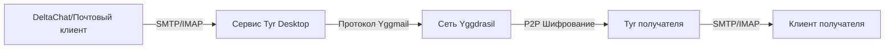

<div align="center">

# Tyr Desktop

### Настоящая P2P электронная почта поверх сети Yggdrasil

[](LICENSE)
[](https://golang.org)
[](https://reactjs.org)
[](https://www.typescriptlang.org)
[](https://wails.io)


[](https://github.com/JB-SelfCompany/Tyr-Desktop)

**[English](README.md) | [Русский](#)**

</div>

---

## 🌐 Что такое Tyr Desktop?

Нас учат, что электронная почта должна проходить через серверы. Почему? Потому что Интернет был построен на централизованной инфраструктуре. Каждое ваше письмо проходит через множество серверов - сервер вашего провайдера, возможно несколько промежуточных серверов, и наконец сервер провайдера получателя. Каждый промежуточный узел - это потенциальная точка слежки, цензуры или отказа.

Даже "зашифрованные" почтовые решения все еще зависят от этих централизованных серверов. Они шифруют содержимое сообщения, но метаданные - с кем вы общаетесь, когда, как часто - видны всем, кто наблюдает за серверами.

Но есть сеть под названием **[Yggdrasil](https://yggdrasil-network.github.io/)**, которая дает каждому бесплатный IPv6 и не требует разрешения от вашего интернет-провайдера. У нас наконец появилась возможность использовать настоящую P2P электронную почту. Более того, эта сеть имеет сильное шифрование для защиты всех данных, передаваемых от одного IP к другому.

**Tyr Desktop приносит настоящую одноранговую электронную почту на ваш компьютер**, используя эти необычные условия. В отличие от традиционных почтовых клиентов, Tyr не нуждается в:

- ❌ Централизованных почтовых серверах (соединения происходят напрямую P2P)
- ❌ Дополнительных уровнях шифрования сообщений (сеть сама заботится об этом)
- ❌ Проброске портов или STUN/TURN серверах (Yggdrasil справляется с NAT traversal)

---

## ✨ Возможности

| Функция | Описание |
|---------|----------|
| 🔗 **Интеграция с DeltaChat** | Автоматическая настройка в один клик с лучшим децентрализованным мессенджером |
| 📧 **Локальный SMTP/IMAP сервер** | Полноценный почтовый сервер прямо на вашем компьютере (порты 1025/1143) |
| 🔐 **Криптографическая идентичность** | Автоматическая генерация Ed25519 ключей - вашу личность невозможно подделать |
| 🌍 **Сеть Yggdrasil** | Подключение через настраиваемые пиры - защита от цензуры по дизайну |
| 🚀 **Автозапуск при загрузке** | Опциональная интеграция с запуском системы для постоянной доступности |
| 💾 **Зашифрованное резервное копирование** | Защищенные паролем бэкапы AES-256-GCM с опциональным экспортом ключей |
| 🔒 **Интеграция с OS Keyring** | Безопасное хранение паролей через Windows Credential Manager / GNOME Keyring |
| 💻 **Современный веб-интерфейс** | Интерфейс на React с Y2K Dark Theme и эффектами стекломорфизма |
| 🌓 **Системные темы** | Автоматическое переключение светлой/темной темы на основе настроек ОС |
| ⚡ **Горячая перезагрузка** | Управление пирами в реальном времени без перезапуска сервиса |
| 📊 **Мониторинг в реальном времени** | Живой статус сервиса, соединения с пирами и просмотр логов |

---

## 🛠️ Как это работает



Tyr Desktop запускает полноценный почтовый сервер прямо на вашем компьютере, используя сеть Yggdrasil для транспорта. Почтовый сервер **[Yggmail](https://github.com/JB-SelfCompany/yggmail)** (написанный на Go) встроен напрямую в приложение.

Он предоставляет стандартные протоколы **SMTP** и **IMAP** на localhost (`127.0.0.1:1025` и `127.0.0.1:1143`). Любой почтовый клиент может подключиться к этим портам - но мы рекомендуем **DeltaChat** для лучшего P2P-опыта обмена сообщениями.

### 📬 Формат почтового адреса

Каждая установка Tyr генерирует уникальные **криптографические ключи Ed25519**. Ваш почтовый адрес получается из вашего публичного ключа:

```
<64-шестнадцатеричных-символа>@yggmail
```

Это означает, что ваша личность **криптографически проверяема** и не может быть подделана.

---

## Системные требования

### Windows
- Windows 10 или новее (64-bit или 32-bit)
- 150 МБ свободного места на диске
- Не требуются права администратора
- WebView2 runtime (обычно предустановлен на Windows 11, автоматически загружается на Windows 10)

### Linux
- Ubuntu 22.04+, Debian 12+ или совместимый дистрибутив
- X11 или Wayland окружение рабочего стола
- 150 МБ свободного места на диске
- WebKitGTK (обычно предустановлен)

## Установка

### Windows

#### Вариант 1: Portable EXE (Рекомендуется)
1. Скачайте из релизов: `Tyr-Desktop-{version}-windows-amd64.exe`
2. Положите в любую папку (например, `C:\Program Files\Tyr`)
3. Запустите `Tyr-Desktop-*.exe`
4. (Опционально) Включите автозапуск в Настройки → Общие

#### Вариант 2: Сборка из исходников
```cmd
git clone https://github.com/JB-SelfCompany/Tyr-Desktop.git
cd Tyr-Desktop
build-windows.bat
```

Бинарник будет создан в `build\bin\`

### Linux

#### Системные требования
- **Необходимые пакеты:**
  - Ubuntu 22.04 / Debian 12 и старше: `build-essential libgtk-3-dev libwebkit2gtk-4.0-dev`
  - Ubuntu 24.04+ / Debian 13+: `build-essential libgtk-3-dev libwebkit2gtk-4.1-dev`

#### Вариант 1: Portable бинарник (Рекомендуется)
```bash
# Скачать бинарник
wget https://github.com/JB-SelfCompany/Tyr-Desktop/releases/download/v2.0.0/Tyr-Desktop-2.0.0-linux-amd64

# Сделать исполняемым
chmod +x Tyr-Desktop-*-linux-amd64

# Запустить
./Tyr-Desktop-*-linux-amd64
```

#### Вариант 2: Сборка из исходников
```bash
# Установить зависимости для сборки
# Для Ubuntu 24.04+ / Debian 13+:
sudo apt-get install build-essential libgtk-3-dev libwebkit2gtk-4.1-dev

# Для Ubuntu 22.04 / Debian 12 и старше:
# sudo apt-get install build-essential libgtk-3-dev libwebkit2gtk-4.0-dev

# Клонировать репозиторий
git clone https://github.com/JB-SelfCompany/Tyr-Desktop.git
cd Tyr-Desktop

# Сделать скрипт сборки исполняемым
chmod +x build-linux.sh

# Собрать (скрипт автоматически определяет и использует правильную версию webkit)
./build-linux.sh
```

Бинарник будет создан в `build/bin/`

## 🔄 Обновление

Для обновления Tyr Desktop до новой версии как на Windows, так и на Linux:

1. **Скачайте или соберите новый бинарник**:
   - Скачайте из [Релизов](https://github.com/JB-SelfCompany/Tyr-Desktop/releases)
   - Или соберите с помощью скриптов: `build-windows.bat` (Windows) / `./build-linux.sh` (Linux)

2. **Замените старый исполняемый файл** новым бинарником

3. **Запустите приложение** - ваши данные сохранятся

### Портативный режим (v2.1.0+)
Все данные хранятся в подпапке `./data/` рядом с исполняемым файлом. При обновлении:
- Ваша конфигурация, база данных и настройки сохраняются автоматически
- Просто замените исполняемый файл, папка `data/` остаётся нетронутой

### Обновление с v2.0.x
При первом запуске v2.1.0+ ваши данные будут автоматически перенесены из старого расположения (`%APPDATA%\Tyr` на Windows или `~/.config/tyr` на Linux) в новую портативную директорию `./data/`.

> **Примечание**: Нет необходимости останавливать сервис перед обновлением. Просто закройте приложение, замените бинарник и перезапустите.

## 📱 Быстрый старт

### Первый запуск

1. **Экран приветствия**: Прочитайте введение о P2P почте и нажмите "Далее"
2. **Настройка пароля**:
   - Создайте пароль (минимум 6 символов)
   - Этот пароль шифрует вашу базу данных Yggmail
   - Хранится безопасно в OS keyring (Windows Credential Manager / GNOME Keyring)
3. **Настройка пиров**:
   - Пир по умолчанию уже настроен: `tcp://bra.zbin.eu:7743`
   - Добавьте свои пиры при необходимости (формат: `tcp://host:port` или `tls://host:port`)
4. **Завершение**: Сервис инициализируется и открывается панель управления

### Настройка DeltaChat

#### Вариант 1: Автоматическая настройка (Рекомендуется)

1. Запустите Tyr Desktop и завершите онбординг
2. Запустите сервис Yggmail с панели управления
3. Установите [DeltaChat Desktop](https://get.delta.chat/)
4. На панели управления Tyr нажмите **"Настроить DeltaChat"**
5. Tyr автоматически откроет DeltaChat с предварительно настроенными параметрами
6. Завершите настройку и начинайте общаться!

#### Вариант 2: Ручная настройка

Если автоматическая настройка не работает:

1. Завершите онбординг Tyr и запустите сервис
2. Скопируйте ваш почтовый адрес с панели управления Tyr (выглядит как `abc123...@yggmail`)
3. В DeltaChat создайте новый профиль
4. Выберите **"Advanced"** → **"Use a different server"**
5. Введите ваш Yggmail адрес и пароль, установленный в Tyr
6. Настройки сервера автоматически настроятся на localhost
7. Нажмите "✓" для завершения настройки

> **Важно**: Tyr должен быть запущен, чтобы DeltaChat мог отправлять и получать сообщения. Включите автозапуск в Настройках для бесшовной работы.

## Использование

### Главная панель

- **Статус сервиса**: Показывает запущен/остановлен/ошибка сервиса Yggmail
- **Почтовый адрес**: Ваш криптографический email адрес (основан на Ed25519 публичном ключе)
  - Формат: `<64-символа-hex-ключа>@yggmail`
  - Нажмите "Копировать" чтобы скопировать в буфер обмена
- **Настройка DeltaChat**: Нажмите для автоматической настройки DeltaChat
- **Информация о сервере**: Локальные адреса SMTP (127.0.0.1:1025) и IMAP (127.0.0.1:1143)
- **Подключенные пиры**: Список активных соединений с пирами Yggdrasil в реальном времени
- **Старт/Стоп сервиса**: Управление жизненным циклом сервиса Yggmail

### Управление пирами

Доступ через Главную панель или Настройки → Сеть:

- **Добавить пир**: Введите URL пира (например, `tcp://example.com:7743`)
- **Включить/Отключить**: Переключать пиры без удаления
- **Удалить**: Удалить пир из списка
- **Статус подключения**: Зеленый = подключен, серый = отключен
- **Горячая перезагрузка**: Изменения применяются немедленно без перезапуска сервиса

### Настройки

#### Общие
- **Автозапуск**: Запускать Tyr при старте системы
- **Язык**: Выбор между английским и русским
- **Тема**: Светлая, Темная или Системная

#### Сеть
- **Управление пирами**: Добавление, удаление, включение/отключение пиров Yggdrasil
- **Обнаружение пиров**: Просмотр рекомендованных пиров по регионам

#### Безопасность
- **Изменить пароль**: Обновить пароль шифрования базы данных Yggmail
- **Сбор логов**: Включить подробное логирование для устранения проблем

#### Резервное копирование и восстановление

**Создать бэкап**:
- Защищенный паролем зашифрованный бэкап AES-256-GCM
- Опционально включить базу данных почты (yggmail.db)
- Сохраняется как `.tyrbackup` файл

**Восстановить бэкап**:
- Выберите `.tyrbackup` файл
- Введите пароль бэкапа
- Восстанавливает конфигурацию и опционально базу данных

### Настройка почтового клиента

#### DeltaChat (Рекомендуется)
1. Нажмите "Настроить DeltaChat" на панели управления
2. DeltaChat откроется с URL автоконфигурации
3. Пароль будет заполнен автоматически
4. Начинайте общаться!

#### Ручная настройка (Thunderbird, K-9 Mail и др.)
- **Email адрес**: Ваш Yggmail адрес с панели управления
- **Пароль**: Ваш пароль Yggmail
- **IMAP сервер**: 127.0.0.1, Порт 1143, Без SSL/TLS
- **SMTP сервер**: 127.0.0.1, Порт 1025, Без SSL/TLS
- **Аутентификация**: Обычный пароль

**Примечание**: Нет SSL/TLS потому что соединения только на localhost. Весь P2P трафик зашифрован Yggdrasil.

## Системный трей

Tyr работает в системном трее (область уведомлений):
- **Левый клик**: Показать/Скрыть главное окно
- **Правый клик**: Контекстное меню
  - Показать: Восстановить главное окно
  - Настройки: Открыть настройки
  - Выход: Закрыть приложение

**Важно**: Закрытие главного окна сворачивает в трей. Используйте "Выход" из меню трея для полного выхода.

## Файлы конфигурации (Портативный режим)

Начиная с версии 2.1.0, Tyr Desktop работает в **портативном режиме**. Все данные хранятся в подпапке `data/` рядом с исполняемым файлом, что делает приложение полностью портативным - просто скопируйте папку для переноса установки.

### Структура файлов
```
Tyr-Desktop.exe (или Tyr-Desktop на Linux)
data/
├── config.toml              # Файл конфигурации
├── yggmail.db               # База данных почты
├── yggmail.db.maildata/     # Содержимое писем и вложения
│   ├── INBOX/
│   ├── Sent/
│   ├── Drafts/
│   ├── Outbox/
│   └── Trash/
├── logs/                    # Логи приложения
└── cache/                   # Файлы кэша
```

### Хранение паролей
- **Windows**: Windows Credential Manager (сервис: `Tyr`, пользователь: `default`)
- **Linux**: GNOME Keyring / KWallet (сервис: `Tyr`, пользователь: `default`)
  - Запасной вариант: `./data/.password` (AES-зашифрован)

### Миграция с предыдущих версий
При обновлении с версии 2.0.x, Tyr автоматически перенесёт ваши данные из старого расположения:
- **Windows**: `%APPDATA%\Tyr` → `./data/`
- **Linux**: `~/.config/tyr` → `./data/`

Старая директория удаляется после успешной миграции.

## Устранение проблем

### Сервис не запускается
- **Проверьте пиры**: Убедитесь что хотя бы один пир включен в Настройки → Сеть → Управление пирами
- **Проверьте логи**: Настройки → Логи
- **Перезапустите сервис**: Остановите и снова запустите с панели управления

### Ошибки с паролем
- **Только Linux**: Если keyring недоступен, пароль хранится в зашифрованном файле
- **Сброс**: Удалите файл конфига и перезапустите (создаст новую личность)

### DeltaChat не подключается
- **Проверьте что сервис запущен**: Панель управления должна показывать статус "Запущен"
- **Проверьте порты**: Убедитесь что SMTP 1025 и IMAP 1143 не блокированы файрволом
- **Ручная настройка**: Скопируйте DCLOGIN URL с панели управления и откройте в браузере

### Бэкап/Восстановление не работает
- **Проверьте пароль**: Минимум 8 символов для пароля бэкапа
- **База данных слишком большая**: Попробуйте бэкап без опции базы данных
- **Права доступа**: Убедитесь в правах на запись в место сохранения бэкапа

### Автозапуск не работает
- **Windows**: Проверьте существование ключа реестра: `regedit` → `HKCU\Software\Microsoft\Windows\CurrentVersion\Run`
- **Linux**: Проверьте desktop entry: `ls ~/.config/autostart/Tyr.desktop`
- **Путь к исполняемому файлу**: Проверьте что путь в записи автозапуска указывает на правильное расположение

## Сборка из исходников

### Требования

- **Go 1.25 или новее**
- **Node.js 18+ и npm**
- **Wails CLI**: Установите с помощью `go install github.com/wailsapp/wails/v2/cmd/wails@latest`
- **C компилятор**:
  - Windows: MinGW-w64 или MSVC
  - Linux: gcc (обычно предустановлен)

### Требования WebView

**Windows:**
- WebView2 runtime (включен в Windows 11, автоматически устанавливается при первом запуске в Windows 10)

**Linux:**
- **Ubuntu 22.04 / Debian 12 и старше:**
  ```bash
  sudo apt-get install build-essential libgtk-3-dev libwebkit2gtk-4.0-dev
  ```
- **Ubuntu 24.04+ / Debian 13+:**
  ```bash
  sudo apt-get install build-essential libgtk-3-dev libwebkit2gtk-4.1-dev
  ```

  При сборке на Ubuntu 24.04+ используйте тег `webkit2_41`:
  ```bash
  wails build -tags webkit2_41
  ```

### Команды сборки

```bash
# Установить зависимости фронтенда
cd frontend && npm install && cd ..

# Режим разработки (горячая перезагрузка)
wails dev

# Production сборка
wails build

# Платформо-специфичные скрипты
# Windows:
build-windows.bat

# Linux:
./build-linux.sh
```

**Расположение выходных файлов:**
- Windows: `build/bin/Tyr-Desktop.exe`
- Linux: `build/bin/Tyr-Desktop`

### Сервер разработки

Wails dev сервер запускается на `http://localhost:34115` с горячей перезагрузкой для изменений фронтенда. Go методы доступны из devtools браузера.

### Аргументы командной строки

- `--minimized` - Запустить приложение свернутым в системный трей (используется автозапуском)

## Соображения безопасности

- **Localhost IMAP/SMTP**: Без SSL/TLS - соединения только на localhost
- **P2P шифрование**: Весь Yggdrasil трафик зашифрован end-to-end
- **Хранение паролей**: Использует OS keyring (Windows Credential Manager / Secret Service)
- **Шифрование бэкапов**: AES-256-GCM с PBKDF2 (100,000 итераций)
- **Нет телеметрии**: Никакого сбора данных или внешних соединений кроме пиров Yggdrasil

## 🔧 Технические детали

| Компонент | Детали |
|-----------|--------|
| **Backend** | Go 1.25+ |
| **Frontend** | React 19, TypeScript 5.9 |
| **Фреймворк** | Wails v2.11 |
| **Управление состоянием** | Zustand |
| **Роутинг** | React Router v6 |
| **Стилизация** | TailwindCSS с Y2K Dark Theme |
| **Анимации** | Framer Motion |
| **Почтовый сервер** | Yggmail (библиотека на Go, прямая интеграция) |
| **Сеть** | Оверлейная mesh-сеть Yggdrasil |
| **Шифрование** | AES-256-GCM (бэкапы), OS Keyring (пароли), Yggdrasil (сеть) |
| **Локализация** | Английский, Русский (i18next) |
| **Платформы** | Windows 10+, Linux (X11/Wayland) |

---

## 🤝 Связанные проекты

- **[Tyr Android](https://github.com/JB-SelfCompany/Tyr)**: P2P почта для Android устройств - тот же протокол, мобильный опыт
- **[Yggmail](https://github.com/JB-SelfCompany/yggmail)**: Агент передачи почты, на котором работает Tyr
- **[Mimir](https://github.com/Revertron/Mimir)**: P2P мессенджер на Yggdrasil (родственный проект)
- **[Yggdrasil Network](https://yggdrasil-network.github.io/)**: Инфраструктура mesh-сети
- **[DeltaChat](https://delta.chat/)**: Рекомендуемый клиент-мессенджер на основе email

---

## 🌟 Почему P2P почта важна

> **Обход цензуры**: Подключайтесь к любому из сотен доступных узлов Yggdrasil, размещайте свой собственный или даже стройте частную сеть. Свобода электронной почты буквально в ваших руках.

> **Конфиденциальность по дизайну**: Никакого сбора метаданных, никаких логов на серверах, никакой слежки третьих лиц. Ваши разговоры принадлежат вам.

> **Децентрализация**: Нет единой точки отказа, нет корпоративного контроля. Настоящая одноранговая архитектура.

---

## 📄 Лицензия

Tyr Desktop - программное обеспечение с открытым исходным кодом. Библиотека Yggmail использует **Mozilla Public License v. 2.0**.

Подробности смотрите в файле [LICENSE](LICENSE).

---

<div align="center">

Made with ❤️ by <a href="https://github.com/JB-SelfCompany">JB-SelfCompany</a>

</div>